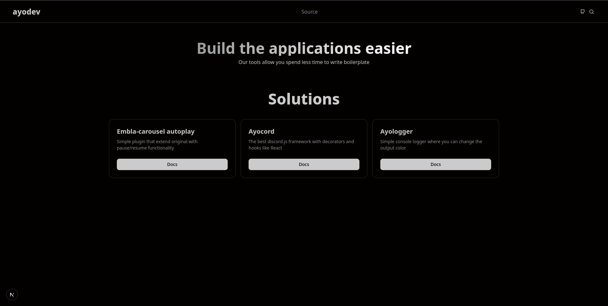
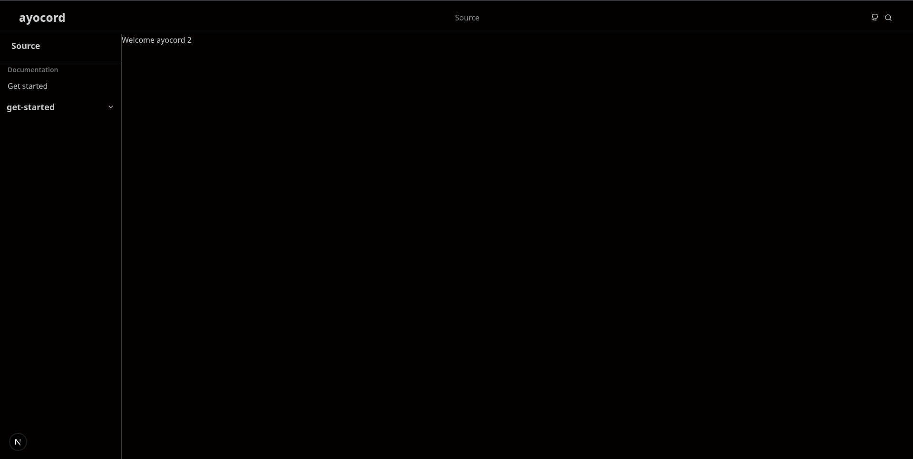

# Ayodev
Ну короче, я хотел выпендриться перед самим собой, что смогу написать шаблон для документации

У меня хватило терпения лишь на:

1. Лэндос 
2. Навигацию (алгоритм который можно сказать GPT писал)
3. Фичу с переключалкой залоговка зависящего от URL

## Скриншоты

### Langing

### Documentation layout page

## Открываю кладбище своих проектов на гитхабе
Если кому-то не похуй, киньте PR сюда с допиленной докой <3

## Stack
1. Nextjs 15
2. Tailwindcss
3. Shadcn ui
4. @next/mdx
5. contentlayer + next-contentlayer